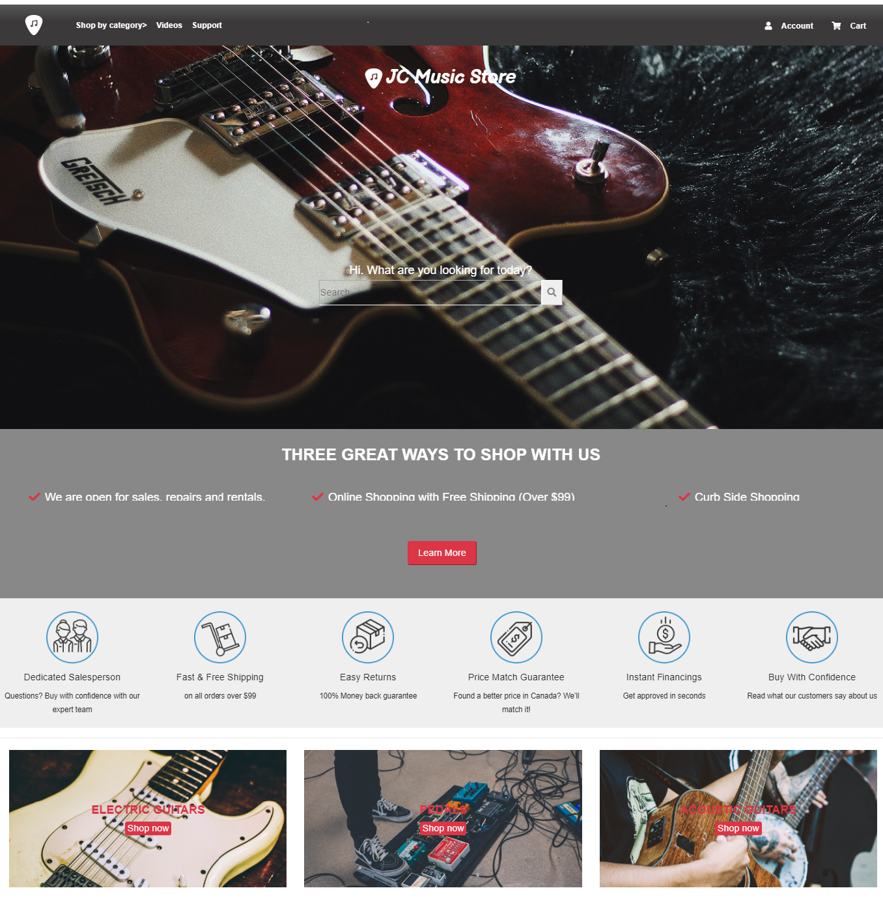

# JC Music Store

> This project was created as a Capstone project for the HTML/CSS module in the Mircoverse curriculum.

This is a responsive site for all the screen sizes, that has a search bar in the header of the page, where you can look for your instruments by name and filter the results by different criteria. 

## Built With

- HTML
- CSS
- Bootstrap

## Live Demo

[Live Demo Link](https://raw.githack.com/janis-jenny/JC-Music-Store/JCStore/index.html)

## Author

👤 **Jenny Cardenas**

- Github: [@janis-jenny](https://github.com/janis-jenny)
- Twitter: [@janis_jenny](https://twitter.com/janis_jenny)
- Linkedin: [linkedin](https://www.linkedin.com/in/paolajenny)

## 🤝 Contributing

Contributions, issues and feature requests are welcome!

Feel free to check the [issues page](https://github.com/janis-jenny/The-Next-Web-Clone-Page/issues).

## Show your support

Give a ⭐️ if you like this project!

## 📝 License

This project is [MIT](https://opensource.org/licenses/MIT) licensed.
